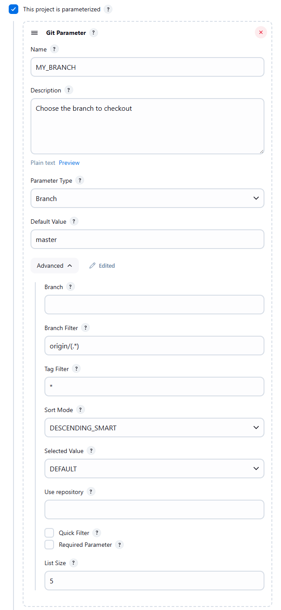
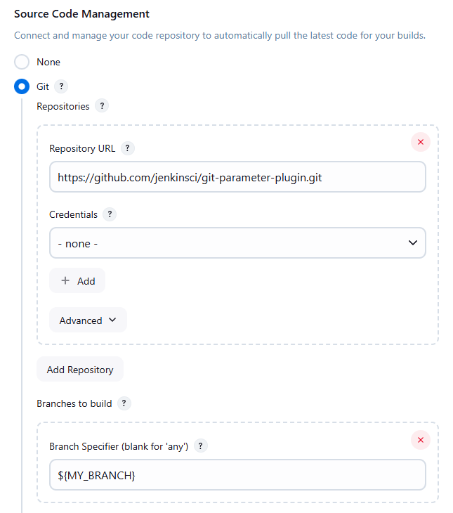
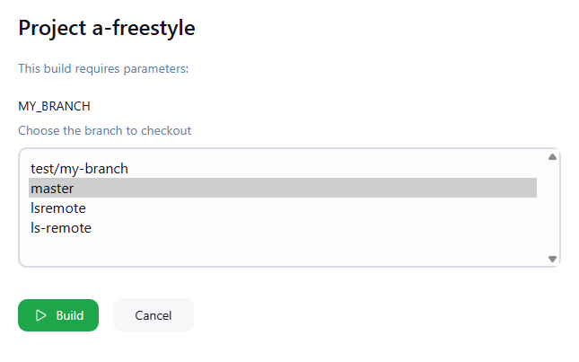

# Git Parameter

This plugin allows you to assign a git branch, tag, pull request, or revision number as a parameter in your builds.

There is no need to configure anything special in plugin settings.
This plugin reads the Git SCM configuration from your projects.
This plugin uses the [Git Plugin](https://plugins.jenkins.io/git/) and [Git Client Plugin](https://plugins.jenkins.io/git-client/).

## Basic configuration

The git parameter plugin supports both [Pipeline projects](#pipeline-script-examples) and [freestyle projects](#freestyle-project-configuration).

## Pipeline script examples

Pipeline development is best assisted by the [Pipeline syntax snippet generator](https://www.jenkins.io/doc/book/pipeline/getting-started/#snippet-generator) that is part of the Jenkins Pipeline plugins.
Snippets for the git parameter plugin can be created with the properties step of the snippet generator or with the parameters section of the declarative directive generator.

The `gitParameter` Pipeline step has a required argument, `type`, that defines the type of values that will be collected from the remote repository.
It must be assigned one of the following values:

* [`PT_BRANCH`](#pt_branch-type) - lists remote branches
* [`PT_BRANCH_TAG`](#pt_branch_tag-type) - lists remote branches and tags
* [`PT_TAG`](#pt_tag-type) - lists remote tags
* [`PT_PULL_REQUEST`](#pt_pull_request-type) - lists remote pull requests
* [`PT_REVISION`](#pt_revision-type) - lists all revisions in the repository

Examples are provided below for each of those values of `type`.

### `PT_BRANCH` type

The `PT_BRANCH` type lists the remote branches that match the branch filter regular expression.

* Declarative Pipeline
```groovy
pipeline {
  agent any
  parameters {
    gitParameter type: 'PT_BRANCH',
                 name: 'A_BRANCH',
                 branchFilter: 'origin/(.*)',
                 defaultValue: 'master',
                 description: 'Choose a branch to checkout',
                 selectedValue: 'DEFAULT',
                 sortMode: 'DESCENDING_SMART'
  }
  stages {
    stage('Example') {
      steps {
        git branch: params.A_BRANCH,
            url: 'https://github.com/jenkinsci/git-plugin.git'
      }
    }
  }
}
```

* Scripted Pipeline
```groovy
properties([
  parameters([
    gitParameter(type: 'PT_BRANCH',
                 name: 'A_BRANCH',
                 branchFilter: 'origin/(.*)',
                 defaultValue: 'master',
                 description: 'Choose a branch for checkout',
                 selectedValue: 'TOP',
                 sortMode: 'ASCENDING_SMART')
  ])
])
node {
  git branch: params.A_BRANCH,
      url: 'https://github.com/jenkinsci/git-plugin.git'
}
```

If you need to use a different type other than the `PT_BRANCH` parameter type, you **must** use the [`checkout scmGit()` step](https://www.jenkins.io/doc/pipeline/steps/params/scmgit/).
The [`git` step](https://www.jenkins.io/doc/pipeline/steps/git/) only supports branches, not tags, pull requests, or other revisions.

###  `PT_BRANCH_TAG` type

```groovy
pipeline {
  agent any
  parameters {
    gitParameter type: 'PT_BRANCH_TAG',
                 name: 'A_BRANCH_TAG',
                 defaultValue: 'git-5.6.0',
                 description: 'Choose a tag or branch to checkout',
                 selectedValue: 'DEFAULT',
                 sortMode: 'DESCENDING_SMART'
  }
  stages {
    stage('Example') {
      steps {
        checkout scmGit(branches: [[name: params.A_BRANCH_TAG]],
                        userRemoteConfigs: [[url: 'https://github.com/jenkinsci/git-plugin.git']])
      }
    }
  }
}
```
### `PT_TAG` type

The `PT_TAG` type lists the remote tags that match the tag filter wild card.
Note that the tag filter is a wild card and not a regular expression.

```groovy
pipeline {
  agent any
  parameters {
    gitParameter type: 'PT_TAG',
                 name: 'A_TAG',
                 defaultValue: 'git-5.5.2',
                 description: 'Choose a git-5.x tag to checkout',
                 selectedValue: 'DEFAULT',
                 sortMode: 'DESCENDING_SMART',
                 tagFilter: 'git-5.*' // Only show tags that start with 'git-5.'
  }
  stages {
    stage('Example') {
      steps {
        checkout scmGit(branches: [[name: params.A_TAG]],
                        userRemoteConfigs: [[url: 'https://github.com/jenkinsci/git-plugin.git']])
      }
    }
  }
}
```

### `PT_PULL_REQUEST` type

The `PT_PULL_REQUEST` type lists pull requests in the remote repository.

```groovy
pipeline {
  agent any
  parameters {
    gitParameter type: 'PT_PULL_REQUEST',
                 name: 'A_PULL_REQUEST',
                 defaultValue: '',
                 description: 'Choose a pull request to checkout',
                 selectedValue: 'TOP',
                 sortMode: 'DESCENDING_SMART'
  }
  stages {
    stage('Example') {
      steps {
        checkout scmGit(branches: [[name: "pr/${params.A_PULL_REQUEST}/head"]],
                        userRemoteConfigs: [[refspec: '+refs/pull/*:refs/remotes/origin/pr/*',
                                             url: 'https://github.com/jenkinsci/git-plugin.git']])
      }
    }
  }
}
```

### `PT_REVISION` type

The `PT_REVISION` type lists all the revisions in the repository that are part of the `branch`.
The`PT_REVISION` type performs a full clone of the remote repository in order to generate the list of revisions.

```groovy
pipeline {
  agent any
  parameters {
    gitParameter type: 'PT_REVISION',
                 name: 'REVISION',
                 branch: 'origin/v3.10.0.x', // Only show commits from v3.10.0.x branch
                 defaultValue: 'HEAD',
                 selectedValue: 'TOP',
                 sortMode: 'DESCENDING_SMART'
  }
  stages {
    stage('Example') {
      steps {
        checkout scmGit(branches: [[name: params.REVISION]],
                        userRemoteConfigs: [[url: 'https://github.com/jenkinsci/git-plugin.git']])
      }
    }
  }
}
```

## Options

### Parameter Type
Name using in Pipeline

```groovy
type: 'PT_TAG' or 'PT_BRANCH' or 'PT_BRANCH_TAG' or 'PT_REVISION' or 'PT_PULL_REQUEST'
```

Explains about `PT_TAG` or `PT_BRANCH` or `PT_BRANCH_TAG`:

Plugin using [git ls-remote](https://git-scm.com/docs/git-ls-remote.html) command to get
remote tags or branches, this solution was implemented in [JENKINS-40232](https://issues.jenkins.io/browse/JENKINS-40232).

In code plugin
[use](https://github.com/jenkinsci/git-client-plugin/blob/9f2a3ec48e699222ce3034dfe14cdb319e563ed5/src/main/java/org/jenkinsci/plugins/gitclient/GitClient.java#L631)ing
getRemoteReferences from GitClient, look implementation
in [CliGitAPIImpl](https://github.com/jenkinsci/git-client-plugin/blob/master/src/main/java/org/jenkinsci/plugins/gitclient/CliGitAPIImpl.java).

```java
package org.jenkinsci.plugins.gitclient
//...

public interface GitClient {
//...
    Map<String, ObjectId> getRemoteReferences(String remoteRepoUrl, String pattern, boolean headsOnly, boolean tagsOnly) throws GitException, InterruptedException;
//...
}
```

### Branch
Name using in Pipeline

```groovy
branch
```

### Branch Filter
Name using in Pipeline

```groovy
branchFilter
```

### Tag Filter
Name using in Pipeline

```groovy
tagFilter
```

### Sort Mode
Name using in Pipeline

```groovy
sortMode: 'NONE' or 'ASCENDING_SMART' or 'DESCENDING_SMART' or 'ASCENDING' or 'DESCENDING'
```

You can select the following sorting options for
tags/revision/branches/branches\_or\_tags/pull requests

-   none
-   descending
-   ascending
-   ascending smart
-   descending smart

For the smart variants the compare treats a sequence of digits as a
single character. Contributed by Graeme Hill.

### Default Value
Name using in Pipeline

```groovy
defaultValue
```

Set a default value because this value is used in the initial build (in Pipeline).
Default value is also returned when an error occurs retrieving data.


### Selected Value
Name using in Pipeline

```groovy
selectedValue: `NONE` or `TOP` or `DEFAULT`
```

### Use repository
Name using in Pipeline

```groovy
useRepository
```

**Remember!**
You don't set a git repository in the plugin.
The plugin uses the git repositories defined in the SCM section of the project.

If multiple repositories are defined, this option specifies which the repository is used to retrieve the parameter values.
*If the `useRepository` option is not defined, the first defined repository is used.*
This option is a regular expression, which is compared to the 'Repository URL'.

You can use multiple SCM repositories in a Pipeline.

Consider an example based on two repositories:

-   <https://github.com/klimas7/exampleA.git>
-   <https://github.com/klimas7/exampleB.git>

**Pipeline: Complex example**

```groovy
pipeline {
    agent any
    parameters {
        gitParameter branchFilter: 'origin.*/(.*)', defaultValue: 'master', name: 'BRANCH_A', type: 'PT_BRANCH', useRepository: '.*exampleA.git'
        gitParameter branchFilter: 'origin.*/(.*)', defaultValue: 'master', name: 'BRANCH_B', type: 'PT_BRANCH', useRepository: '.*exampleB.git'

    }
    stages {
        stage('Example') {
            steps {
                git branch: params.BRANCH_A, url: 'https://github.com/klimas7/exampleA.git'
                git branch: params.BRANCH_B, url: 'https://github.com/klimas7/exampleB.git'
            }
        }
    }
}
```

After initial run you get


Example when 'Use repository' is not set:

**Pipeline: Use repository is not set**

```groovy
pipeline {
    agent any
    parameters {
        gitParameter branchFilter: 'origin.*/(.*)', defaultValue: 'master', name: 'BRANCH', type: 'PT_BRANCH'
    }
    stages {
        stage('Example') {
            steps {
                git url: 'https://github.com/klimas7/exampleA.git'
                dir('dir-for-exampleB') {
                    git url: 'https://github.com/klimas7/exampleB.git'
                }
            }
        }
    }
}
```

After initial run you get


### Quick Filter

```groovy
quickFilterEnabled
```

### List Size

```groovy
listSize
```

## Freestyle project configuration





### Build with Parameters form



## Global configuration


## Error handling

If an error occurred while retrieving data, the default value is returned.
Additional information is provided below, along with the cause of the error.

Examples:
1. This error occur when the repository is not configured or 'Use repository' option not match with any repository.
   
2. This error occur when the repository is not exists or URL is wrong.
   
3. This error occur when there are no ssh command on Jenkins master.
   

## Changelog

For recent versions, see [GitHub Releases](https://github.com/jenkinsci/git-parameter-plugin/releases)

For versions 0.9.11 and older, see the [legacy CHANGELOG](https://github.com/jenkinsci/git-parameter-plugin/blob/git-parameter-0.9.19/CHANGELOG.md)
