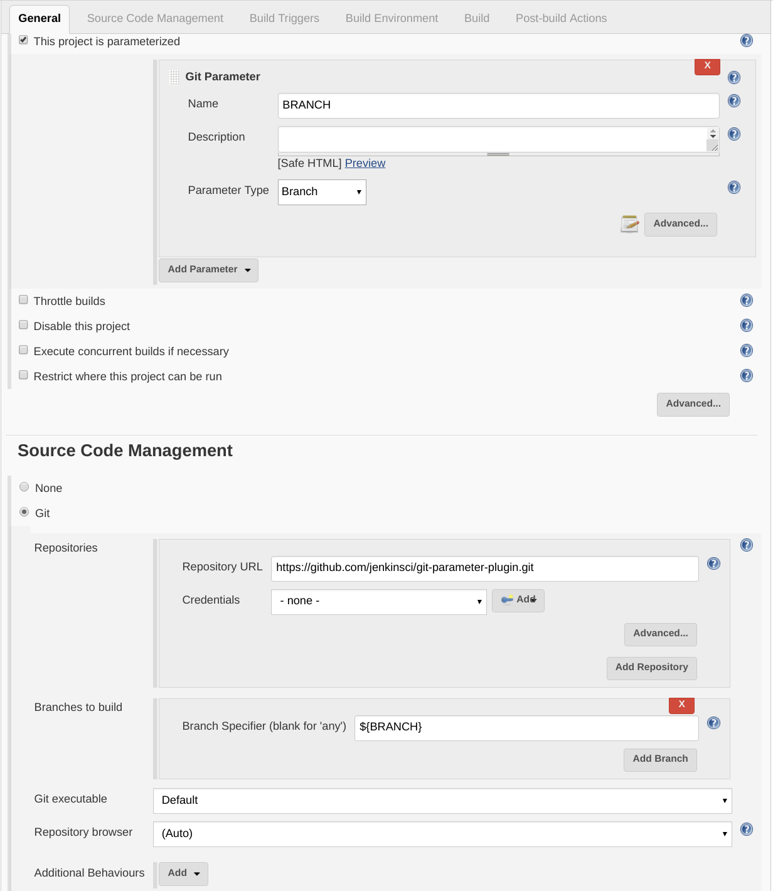
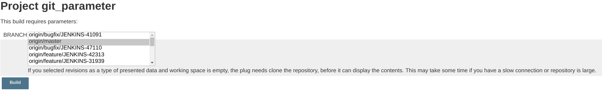
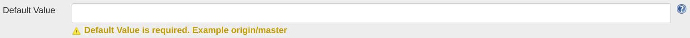
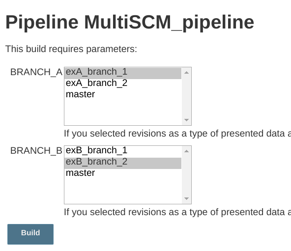
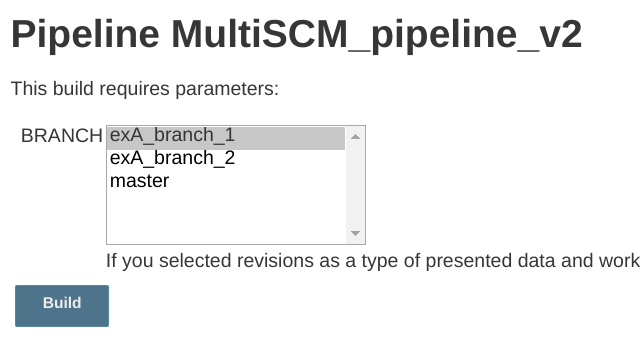
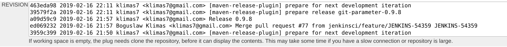
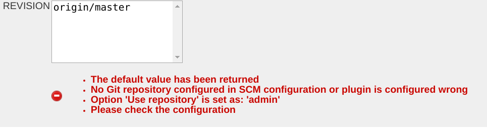
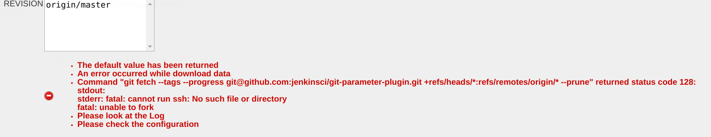

# Git Parameter

This plugin allows you to assign a git branch, tag, pull request, or revision number as a parameter in your builds.

There is no need to configure anything special in plugin settings.
This plugin reads the Git SCM configuration from your projects.
This plugin uses the [Git Plugin](https://plugins.jenkins.io/git/) and [Git Client Plugin](https://plugins.jenkins.io/git-client/).

## Basic configuration

The git parameter plugin supports both Pipeline projects and freestyle projects.

### Freestyle project configuration



### Build with Parameters form



## Pipeline script examples

Pipeline development is best assisted by the [Pipeline syntax snippet generator](https://www.jenkins.io/doc/book/pipeline/getting-started/#snippet-generator) that is part of the Jenkins Pipeline plugins.
This documentation provides several examples of the `gitParameter` Pipeline step.

The `gitParameter` Pipeline step has a required argument, `type`, that defines the type of values that will be collected from the remote repository.
It must be assigned one of the following values:

* [`PT_BRANCH`](#pt_branch-type)
* [`PT_BRANCH_TAG`](#pt_branch_tag-type)
* [`PT_TAG`](#pt_tag-type)
* [`PT_PULL_REQUEST`](#pt_pull_request-type)
* [`PT_REVISION`](#pt_revision-type)

Examples are provided below for each of those values of `type`.

### `PT_BRANCH` type

The `PT_BRANCH` type lists the remote branches that match the branch filter regular expression.

* Declarative Pipeline
```groovy
// Using git step instead of checkout scm step
pipeline {
  agent any
  parameters {
    gitParameter type: 'PT_BRANCH',
                 name: 'A_BRANCH'
                 defaultValue: 'master',
                 branchFilter: 'origin/(.*)',
  }
  stages {
    stage('Example') {
      steps {
        git branch: params.A_BRANCH,
            url: 'https://github.com/jenkinsci/git-parameter-plugin.git'
      }
    }
  }
}
```

* Scripted Pipeline
```groovy
// Using git step instead of checkout scm step
properties([
  parameters([
    gitParameter(type: 'PT_BRANCH',
                 name: 'A_BRANCH',
                 branch: '',
                 branchFilter: 'origin/(.*)',
                 defaultValue: 'master',
                 description: 'Choose a branch for checkout',
                 quickFilterEnabled: false,
                 selectedValue: 'NONE',
                 sortMode: 'NONE',
                 tagFilter: '*')
    ])
  ])
node {
  git branch: params.A_BRANCH,
      url: 'https://github.com/jenkinsci/git-parameter-plugin.git'
}
```

###  `PT_BRANCH_TAG` type

```groovy
// Using checkout step
pipeline {
  agent any
  parameters {
    gitParameter type: 'PT_BRANCH_TAG',
                 name: 'A_BRANCH_TAG',
                 defaultValue: 'master'
  }
  stages {
    stage('Example') {
      steps {
        checkout scmGit(branches: [[name: params.A_BRANCH_TAG]],
                        userRemoteConfigs: [[url: 'https://github.com/jenkinsci/git-parameter-plugin.git']])
      }
    }
  }
}
```

#### Important settings:

#### Parameter type


**Important!**
If you need to use a different type then the branch parameter type, you must use the `checkout` step.

### `PT_TAG` type

The `PT_TAG` type lists the remote tags that match the tag filter wild card.

```groovy
// Using checkout step
pipeline {
  agent any
  parameters {
    gitParameter type: 'PT_TAG',
                 name: 'A_TAG',
                 defaultValue: 'master'
  }
  stages {
    stage('Example') {
      steps {
        checkout scmGit(branches: [[name: params.A_TAG]],
                        userRemoteConfigs: [[url: 'https://github.com/jenkinsci/git-parameter-plugin.git']])
      }
    }
  }
}
```

### `PT_PULL_REQUEST` type

The `PT_PULL_REQUEST` type lists pull requests in the remote repository.

```groovy
// Using checkout step
pipeline {
  agent any
  parameters {
    gitParameter type: 'PT_PULL_REQUEST',
                 name: 'A_PULL_REQUEST',
                 defaultValue: '1',
                 sortMode: 'DESCENDING_SMART'
  }
  stages {
    stage('Example') {
      steps {
        checkout scmGit(branches: [[name: "pr/${params.A_PULL_REQUEST}/head"]],
                        userRemoteConfigs: [[refspec: '+refs/pull/*:refs/remotes/origin/pr/*',
                                             url: 'https://github.com/jenkinsci/git-parameter-plugin.git']])
      }
    }
  }
}
```

### `PT_REVISION` type

The `PT_REVISION` type lists the revisions in the repository.
The`PT_REVISION` type performs a full clone of the remote repository in order to generate the list of revisions. 

```groovy
// Using checkout step
pipeline {
  agent any
  parameters {
    gitParameter type: 'PT_REVISION',
                 name: 'REVISION',
                 defaultValue: 'master'
  }
  stages {
    stage('Example') {
      steps {
        checkout scmGit(branches: [[name: params.REVISION]],
                        userRemoteConfigs: [[url: 'https://github.com/jenkinsci/git-parameter-plugin.git']])
      }
    }
  }
}
```

## Options

### Parameter Type
Name using in Pipeline

```groovy
type: 'PT_TAG' or 'PT_BRANCH' or 'PT_BRANCH_TAG' or 'PT_REVISION' or 'PT_PULL_REQUEST'
```

Explains about `PT_TAG` or `PT_BRANCH` or `PT_BRANCH_TAG`:

Plugin using [git ls-remote](https://git-scm.com/docs/git-ls-remote.html) command to get
remote tags or branches, this solution was implemented in [JENKINS-40232](https://issues.jenkins.io/browse/JENKINS-40232).

In code plugin
[use](https://github.com/jenkinsci/git-client-plugin/blob/9f2a3ec48e699222ce3034dfe14cdb319e563ed5/src/main/java/org/jenkinsci/plugins/gitclient/GitClient.java#L631)ing
getRemoteReferences from GitClient, look implementation
in [CliGitAPIImpl](https://github.com/jenkinsci/git-client-plugin/blob/master/src/main/java/org/jenkinsci/plugins/gitclient/CliGitAPIImpl.java).

```java
package org.jenkinsci.plugins.gitclient
//...

public interface GitClient {
//...
    Map<String, ObjectId> getRemoteReferences(String remoteRepoUrl, String pattern, boolean headsOnly, boolean tagsOnly) throws GitException, InterruptedException;
//...
}
```

### Branch
Name using in Pipeline

```groovy
branch
```

### Branch Filter
Name using in Pipeline

```groovy
branchFilter
```

### Tag Filter
Name using in Pipeline

```groovy
tagFilter
```

### Sort Mode
Name using in Pipeline

```groovy
sortMode: 'NONE' or 'ASCENDING_SMART' or 'DESCENDING_SMART' or 'ASCENDING' or 'DESCENDING'
```

You can select the following sorting options for
tags/revision/branches/branches\_or\_tags/pull requests

-   none
-   descending
-   ascending
-   ascending smart
-   descending smart

For the smart variants the compare treats a sequence of digits as a
single character. Contributed by Graeme Hill.

### Default Value
Name using in Pipeline

```groovy
defaultValue
```

Set a default value because this value is used in the initial build (in Pipeline).
Default value is also returned when an error occurs retrieving data.



### Selected Value
Name using in Pipeline

```groovy
selectedValue: `NONE` or `TOP` or `DEFAULT`
```

### Use repository
Name using in Pipeline

```groovy
useRepository
```

**Remember!**
You don't set a git repository into the plugin, this plugin
using git repositories which are defined in project in SCM section!

If in the task are defined multiple repositories, this option specifies
which the repository is taken into account on getting data.
*If the option is not defined, is taken a first defined repository.*
This option is a regular expression, which is compared to the
'Repository URL'.

You can define the multiple SCM in a Pipeline.

Consider an example based on two repositories:

-   <https://github.com/klimas7/exampleA.git>
-   <https://github.com/klimas7/exampleB.git>

**Pipeline: Complex example**

```groovy
pipeline {
    agent any
    parameters {
        gitParameter branchFilter: 'origin.*/(.*)', defaultValue: 'master', name: 'BRANCH_A', type: 'PT_BRANCH', useRepository: '.*exampleA.git'
        gitParameter branchFilter: 'origin.*/(.*)', defaultValue: 'master', name: 'BRANCH_B', type: 'PT_BRANCH', useRepository: '.*exampleB.git'

    }
    stages {
        stage('Example') {
            steps {
                git branch: params.BRANCH_A, url: 'https://github.com/klimas7/exampleA.git'
                git branch: params.BRANCH_B, url: 'https://github.com/klimas7/exampleB.git'
            }
        }
    }
}
```

After initial run you get



Example when 'Use repository' is not set:

**Pipeline: Use repository is not set**

```groovy
pipeline {
    agent any
    parameters {
        gitParameter branchFilter: 'origin.*/(.*)', defaultValue: 'master', name: 'BRANCH', type: 'PT_BRANCH'
    }
    stages {
        stage('Example') {
            steps {
                git url: 'https://github.com/klimas7/exampleA.git'
                dir('dir-for-exampleB') {
                    git url: 'https://github.com/klimas7/exampleB.git'
                }
            }
        }
    }
}
```

After initial run you get



### Quick Filter

```groovy
quickFilterEnabled
```

### List Size

```groovy
listSize
```

## Global configuration

**Important!**
Works with version 0.9.9 or greater




## Error handling

If an error occurred while retrieving data, the default value is returned.
Additional information is provided below, along with the cause of the error.

Examples:
1. This error occur when the repository is not configured or 'Use repository' option not match with any repository.
   
2. This error occur when the repository is not exists or URL is wrong.
   
3. This error occur when there are no ssh command on Jenkins master.
   

## Contribute

* You may checkout/clone this project and build it by simply calling `mvn clean install` in the root of the checkout. Test your changes by going to your Jenkins-CI site and import the generated `target/git-parameter.hpi` by going to your base URL + `jenkins/pluginManager/advanced`. There you find an option to upload a plugin.

### Pull Request Policy

If you want to add some changes for this plugin:
Add the issue in jenkins [JIRA](https://issues.jenkins.io) to the component git-parameter-plugin
Describe there why you need to change the plugin.

### TODO

* Add a new method `listRemoteTags(URL)` to git-client-plugin to use. Will speed up listing tags and avoids cloning/fetching the content.

* Fix the pending issues from
	* Even though the GIT SCM module has the ability to provide "credentials" (SSH key) for the repository, the git-parameter plugin doesn't seem to use them. "Issue lukanus":https://github.com/lukanus/git-parameter/issues/14
* Allow translations by converting all html stuff to jelly
* Add explanation when configuring the sort mode
* Allow regular expressions when sorting.
* Better testing. How to we test the configuration dialog? How do we test whether correct tags are listed when a user triggers a build?

## Development history

This plugin was offered to the community by lukanus (Łukasz Miłkowski <lukanus@uaznia.net>) end of 2011. He was active till February 2012.

In May 2014 ngiger (Niklaus Giger niklaus.giger) decided to maintain this plugin and bring in the various improvements made by others.

March 2016 klimas7 (Boguslaw Klimas) he began to the care and maintenance of the plugin.. We will see ... :)

## Changelog

For recent versions, see [GitHub Releases](https://github.com/jenkinsci/git-parameter-plugin/releases)

For versions 0.9.11 and older, see the [legacy CHANGELOG](https://github.com/jenkinsci/git-parameter-plugin/blob/git-parameter-0.9.19/CHANGELOG.md)
